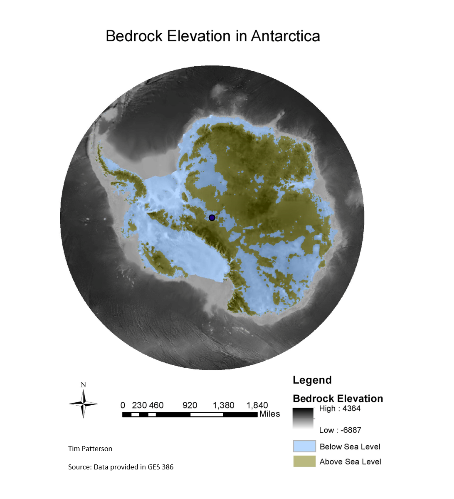
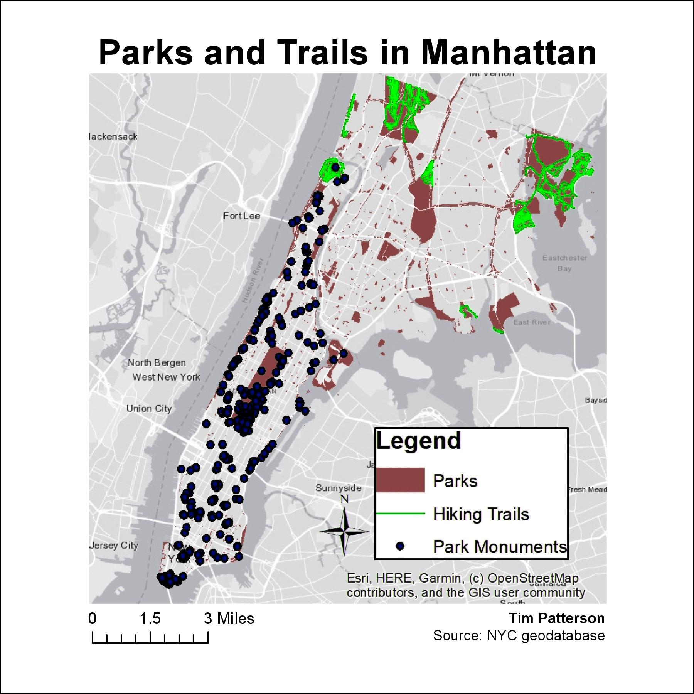
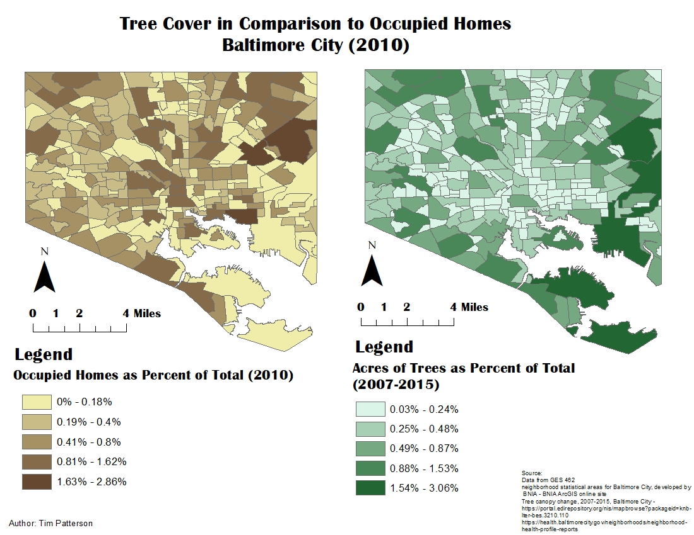

## Portfolio

---

### [Bedrock Elevation in Antartica](/Projects/index)
This is a map displaying the bedrock elevation in Antartica as well as showing areas below and avove Sea Level.

---
### [Parks and Trails in Manhattan](/Projects/index)
This is a map that shows the trails and parks of Manhattan.

---
### [Tree Cover Comparison to Occupied Homes in Baltimore City (2010)](/Projects/index)
This map displays a comparison of tree cover to occupied homes of Baltimre City in 2010.

---

### Category Name 2

- [Project 1 Title](http://example.com/)
- [Project 2 Title](http://example.com/)
- [Project 3 Title](http://example.com/)
- [Project 4 Title](http://example.com/)
- [Project 5 Title](http://example.com/)

---

---

Page template forked from <a href="https://github.com/evanca/quick-portfolio">evanca</a>

<!-- Remove above link if you don't want to attibute -->
